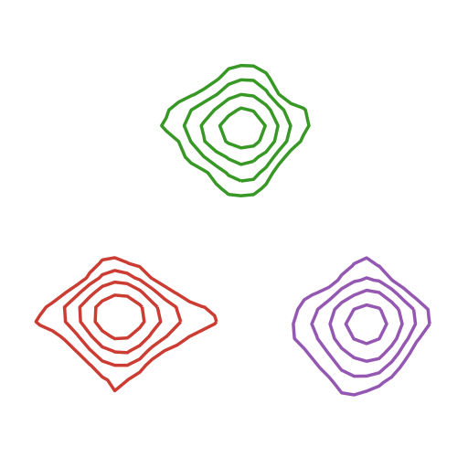

# NMRTools.jl

[](https://waudbygroup.github.io/NMRTools.jl/stable)
[](https://waudbygroup.github.io/NMRTools.jl/dev)
[](https://github.com/waudbygroup/NMRTools.jl/actions/workflows/Runtests.yml)
[](https://codecov.io/gh/waudbygroup/NMRTools.jl)
[](https://zenodo.org/badge/latestdoi/251587402)



NMRTools.jl is a Julia library for working with NMR spectroscopy data. It provides a simple interface for importing and handling 1D, 2D, and higher-dimensional datasets.

## Features

- **Multi-format support**: Read Bruker, nmrPipe and UCSF/Sparky formatted data
- **Intuitive data access**: Array-like indexing with chemical shift values using `spec[8.0 .. 9.0]` syntax
- **Built-in plotting**: Publication-quality plots with sensible defaults via Plots.jl recipes
- **Metadata handling**: Easily access acquisition parameters from Bruker `acqus` files
- **DimensionalData.jl integration**: Leverage powerful array indexing with named dimensions to work seamlessly with frequency, time, and gradient dimensions

## Quick Start

Install NMRTools.jl through the Julia package manager:

```julia
using Pkg
Pkg.add("NMRTools")
```

Load and plot a spectrum:

```julia
using NMRTools, Plots

# Load data (auto-detects format)
spec = loadnmr("path/to/experiment")

# Plot the full spectrum
plot(spec)

# Zoom to a chemical shift range
plot(spec[8.0 .. 9.0])

# Access data and metadata
data(spec)
metadata(spec)
```

## Documentation

Documentation with tutorials and examples is available at:
- [**Stable docs**](https://waudbylab.org/NMRTools.jl/stable) - Latest release
- [**Dev docs**](https://waudbylab.org/NMRTools.jl/dev) - Development version

## Development Status

> **NOTE**: This package is under active development and it may be a while before its features and syntax stabilise. Please refer to the [documentation](https://waudbygroup.github.io/NMRTools.jl/stable) for current usage examples.

## Citation

If you use NMRTools.jl in your research, please cite:
[](https://zenodo.org/badge/latestdoi/251587402)
